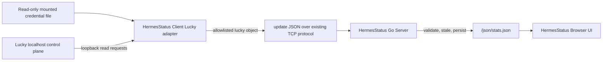

# Lucky Monitoring 设计

## 目录

- [状态](#状态)
- [目标与边界](#目标与边界)
- [已确认事实](#已确认事实)
- [架构](#架构)
- [数据来源决策](#数据来源决策)
- [字段可获取性](#字段可获取性)
- [刷新与降级](#刷新与降级)
- [前端信息架构](#前端信息架构)
- [非目标](#非目标)
- [未确认事项](#未确认事项)
- [进入实现阶段的门禁](#进入实现阶段的门禁)
- [关联文档](#关联文档)

## 状态

本文是 HermesStatus 2.1 Lucky Monitoring 第一轮设计资产，不是实现完成声明。第一轮只完成基线、运行方式、接口、认证、字段、数据合同、安全边界、UI 和实施计划的摸排。

当前设计基线为 `origin/2.0` 的 `627f722521f3d042941c8e58da74e83d83aa8ad3`。旧 `codex/2.1-lucky-design` Worktree 保留为只读参考；实际设计工作位于 `codex/2.1-lucky-monitoring`。

## 目标与边界

Lucky 是与 `hardware`、`docker`、`hermes` 并列的独立节点级业务域。它只提供运行和配置摘要，不提供管理能力。

- Browser 只读取 HermesStatus `/json/stats.json`。
- Browser 不请求 Lucky，不持有 Lucky 凭据。
- Server 只接收、验证、保存和输出结构化 `lucky`，不持有 Lucky 凭据。
- Client 通过同宿主机回环地址访问 Lucky。
- 默认访问地址为 `http://127.0.0.1:16601`；不需要生产远程地址。
- 不增加数据库、历史时序、告警、多节点管理或 Lucky 写操作。
- 不新增 `lucky_json` Legacy 字段。
- Lucky 单域失败不得影响原生指标或其他扩展域。

## 已确认事实

| 项目 | 结论 | 证据等级 |
| --- | --- | --- |
| 运行方式 | 宿主机 systemd 服务，不是 Docker 容器 | 运行环境只读检查 |
| 进程 | 单一本机原生二进制进程，由 systemd 管理 | 运行环境只读检查 |
| 管理监听 | 回环 HTTP 控制面，端口 `16601` | 监听和 HTTP 只读检查 |
| 与 Client 的关系 | 最终部署中同宿主机；Client 采用 host network，可访问宿主机回环地址 | 用户确认和 Compose 审计 |
| 当前版本 | `2.27.2` | 公共 `GET /version` |
| 配置形式 | Lucky 2.x 使用分模块状态文件；启动参数仍兼容指定配置入口 | 官方文档和只读目录结构 |
| Web 架构 | Vue 前端和后端分离 | 官方文档和静态资源 |
| 管理认证 | Web 登录态请求使用 `Lucky-Admin-Token` Header | 静态前端请求拦截器 |
| OpenToken | 官方说明可调用 API；可用 `openToken` Header 或查询参数 | 官方文档和静态前端文案 |
| 只读权限范围 | 未发现 OpenToken 的端点级或方法级只读授权 | 未确认，属于阻断项 |
| HTTP 成功判定 | API 可能返回 HTTP 200 但以 JSON `ret` 表示失败 | 未认证只读探测 |
| WebSocket | 状态页使用 WebSocket；Web 终端另有携带管理 Token 的 WebSocket | 静态前端 |
| SSE | 未发现 EventSource/SSE | 静态前端 |

证据等级按 [Lucky API Inventory](LUCKY_API_INVENTORY.md) 中的 Level A-E 规则使用。内部 Web API 的路径和方法已确认，但响应 Schema 尚未通过受控、脱敏的已认证样本完全固化。

## 架构

认证信息只允许沿 `Secret -> Collector` 这一条边存在。任何 Lucky 原始响应、Header、Token、Cookie、配置或证书内容都不能进入 TCP、NodeState、持久化 stats、OpenAPI、日志或 Browser。

## 数据来源决策

| 业务字段 | 首选来源 | 备选来源 | 当前结论 |
| --- | --- | --- | --- |
| 服务状态 | systemd 状态 + API 可达性 | 进程检查 | 两者组合，不能只依赖端口 |
| 当前版本 | `GET /version` | `GET /api/info`、二进制版本 | 公共接口可用 |
| 最新版本 | Lucky 已有官方版本信息来源 | 官方发布源，带长 TTL | 来源机制已定位，稳定响应合同待确认 |
| IP 解析摘要 | `GET /api/netinterfaces` 与 DDNS 任务数据 | Lucky 配置/状态 | 只输出数量和模式，不输出地址 |
| DDNS | `GET /api/ddnstasklist`、`GET /api/ddns/task/{id}` | 分模块状态文件 | 内部 Web 只读 API |
| Web 服务 | `GET /api/webservice/rules`、规则详情 | 分模块状态文件 | 内部 Web 只读 API |
| 端口转发 | `GET /api/portforwards`、规则详情 | 分模块状态文件 | 内部 Web 只读 API |
| 证书 | `GET /api/ssl`、证书详情 | 仅在 API 不可用时读取公开证书元数据 | 内部 Web 只读 API |

来源优先级是：官方稳定只读 API（A）> Web 内部只读 API（B）> 本地状态（C）> CLI/进程推导（D）> DOM（E）。本设计不采用 DOM 作为生产主路径。

## 字段可获取性

| 目标字段 | 可获取性 | 默认输出 | 备注 |
| --- | --- | --- | --- |
| `service_state` | 已确认 | 是 | systemd + API 组合 |
| `process_running` | 已确认 | 是 | 不单独证明业务健康 |
| `process_pid` | 可获取 | 否 | 无展示价值，避免暴露运行细节 |
| `uptime_seconds` | 可获取 | 是 | systemd/进程启动时间推导 |
| `version_current` | 已确认 | 是 | `/version` |
| `version_latest` | 部分确认 | nullable | 必须先固化官方响应合同和缓存 |
| `update_available` | 可计算 | nullable | 仅在两个规范化版本都可靠时计算 |
| `build_info` | 部分确认 | 仅 `build_time` | 不透传任意构建对象 |
| API/Web reachable | 已确认 | 是 | 分开记录 |
| IP 解析方式 | API 可候选 | nullable | 响应字段待样本验证 |
| IPv4/IPv6/总数 | API 可候选 | 是，计数 | 不输出地址数组 |
| DDNS 数量和记录摘要 | API 可候选 | 是 | 名称可配置脱敏，域名默认不输出 |
| Web 服务数量和摘要 | API 可候选 | 是 | 不输出上游地址和 Header |
| 端口转发数量和摘要 | API 可候选 | 是 | 不输出目标地址 |
| 证书数量和有效期 | API 可候选 | 是 | 不读取私钥；名称使用业务名或脱敏标识 |
| 证书链有效性 | 未确认 | `unknown` | 不把日期有效等同于证书链验证 |
| 模块错误 | 可获取/可归一化 | 是 | 只输出安全错误枚举和短摘要 |

## 刷新与降级

- Lucky 完整采集默认每 600 秒执行一次，与前端 10 分钟刷新口径一致。
- Client 仍按原有主循环发送最近一次结构化结果，不为 Lucky 新增 TCP 通道。
- Server 输出时按 900 秒阈值重新计算 Lucky 域和模块 `stale`。
- `updated_at` 是客户端完成采集的时间；`received_at` 仍由 Server 生成。
- 最新版本查询使用至少 6 小时 TTL；失败时保留 last-good 值和原时间，并只降级版本子模块。
- 单个模块失败时保留其他模块结果；整个 Lucky 不可达时仅 Lucky 为 `unavailable`。
- Lucky 未启用时为 `not_configured`，不能伪装成零规则的健康实例。
- API 判定必须同时检查 HTTP、JSON 顶层对象和 Lucky `ret`，不以 HTTP 200 单独判定成功。

## 前端信息架构

### 导航

新增与“主页”“Docker”同级的“Lucky”标签，Hash 为 `#lucky`。标签切换只渲染已缓存的 `currentStats`，不发起请求。

### 主页摘要

主页增加一个 Lucky 摘要区，显示：

- 总体状态、当前/最新版本和更新状态；
- IP 解析方式及 IPv4/IPv6/总数；
- DDNS、Web 服务、端口转发、证书数量；
- 即将到期和已过期证书数量；
- 数据更新时间、stale 和安全错误摘要。

### Lucky 页面

页面顺序固定为：Overview、Dynamic DNS、Web Services、Port Forwarding、Certificates。列表只展示数据合同允许的字段，无原始 JSON、完整域名、目标地址、凭据或控制按钮。

页面继续复用：

- 单一 `currentStats`；
- 单一 10 分钟 `setInterval`；
- 全局手动刷新；
- `/json/stats.json` 和 `cache: no-store`；
- 现有 stale/error badge 和响应式布局。

## 非目标

- Lucky 启动、停止、重启、升级、规则启停或配置修改。
- 证书签发、续签、同步或私钥检查。
- 公开 IP、完整域名、内网目标、完整监听地址或原始日志展示。
- Browser 复用 Lucky 登录态、Cookie、管理 Token 或 WebSocket。
- Server 保存 Lucky 凭据。
- Lucky 历史时序、告警或多实例管理。

## 未确认事项

1. OpenToken 是否能限制为只读端点；当前证据只证明它可以调用 API。
2. 选定内部 API 在当前版本的完整响应字段、类型和空值行为。
3. 最新版本官方数据源的稳定 URL、响应 Schema 和失败语义。
4. Lucky 对证书链错误、自动续签和下次续签时间的可用字段。
5. DDNS、Web 服务和转发规则的稳定业务名称字段以及脱敏策略。
6. `/api/status` WebSocket/HTTP 数据是否值得作为运行摘要来源；首版不依赖状态流。

## 进入实现阶段的门禁

数据合同、UI 和分阶段计划已具备实现评审条件；生产采集仍需在以下两项中至少确认一项：

1. OpenToken 具备可接受的只读或来源限制；或
2. 用户明确接受“仅限本机回环、专用 Secret 文件、但 Token 可能具有管理能力”的剩余风险。

在门禁确认前，可以实现 fixture、Schema、mock adapter 和 UI，但不得把管理 Token 部署进 Client。

## 关联文档

- [API 清单](LUCKY_API_INVENTORY.md)
- [数据合同](LUCKY_DATA_CONTRACT.md)
- [安全边界](LUCKY_SECURITY.md)
- [部署与实施计划](LUCKY_DEPLOYMENT_PLAN.md)
- [现有 Stats 合同](../migration/STATS_CONTRACT.md)
- [现有架构](../architecture/ARCHITECTURE.md)

