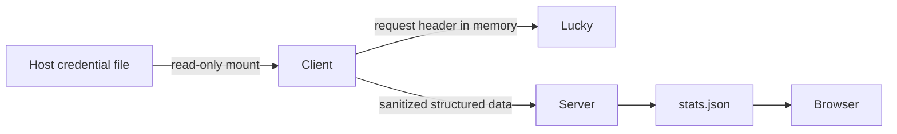

# Lucky Monitoring 安全边界

## 目录

- [信任边界](#信任边界)
- [认证决策](#认证决策)
- [OpenToken 风险](#opentoken-风险)
- [请求约束](#请求约束)
- [数据最小化](#数据最小化)
- [Secret 生命周期](#secret-生命周期)
- [日志和错误](#日志和错误)
- [Server 与 Browser 边界](#server-与-browser-边界)
- [Runtime Hardening](#runtime-hardening)
- [威胁与控制](#威胁与控制)
- [安全门禁](#安全门禁)
- [关联文档](#关联文档)

## 信任边界

最终部署中 HermesStatus Client 和 Lucky 位于同一宿主机。Client 使用 host network，因此默认只访问 `http://127.0.0.1:16601`。

回环 HTTP 的信任前提是：

- Lucky 控制面不需要为 HermesStatus 改为外网监听；
- Client 容器已具有 host network，Lucky 不引入额外网络权限；
- 请求不经过反向代理、公共 DNS 或第三方网络；
- 凭据仍必须认证，回环不等同于无授权；
- 宿主机 root 或同网络命名空间高权限进程不在 HermesStatus 能防御的范围内。

## 认证决策

| 方式 | 结论 | 原因 |
| --- | --- | --- |
| localhost 无认证 | 仅 `/version` 可用 | 无法读取模块摘要 |
| 官方只读 Token | 首选 | 当前尚未发现可验证的只读 scope |
| OpenToken | 有条件候选 | 官方支持 API 调用，但权限边界未文档化 |
| 专用监控账号 | 次选 | Lucky 是否支持只读角色未确认 |
| Web 管理 Token | 不作为默认 | 可能拥有完整管理能力 |
| Browser Cookie/session | 禁止 | 生命周期不稳定且扩大凭据暴露面 |

生产实现建议使用 `LUCKY_TOKEN_FILE` 指向只读挂载文件；不通过查询参数、命令行参数或仓库配置传递凭据。

## OpenToken 风险

官方前端明确说明 OpenToken 可调用 API，并允许放在 Header 或 URL 参数中，但没有提供端点级、Method 级或只读 scope 文档。当前不能把“OpenToken”解释成“只读 Token”。

因此：

1. adapter 只实现编译期 allowlist 的 GET 路径；
2. 业务层不能传入任意 path、method、query 或 body；
3. 禁止 URL 查询参数认证，只允许 Header；
4. Token 文件只挂载到 Client；
5. Token 可能拥有管理能力的剩余风险必须在部署前显式接受；
6. 若 Lucky 后续提供只读 scope，应迁移到最小权限 Token。

## 请求约束

| 控制 | 默认 |
| --- | --- |
| Base URL | 固定回环 HTTP；生产不配置远程地址 |
| Method | allowlist GET only |
| 连接超时 | 2 秒 |
| 读取超时 | 5 秒 |
| 重试 | 单轮不自动重试；等待下个 600 秒周期 |
| 最大单响应 | 1 MiB；模块可进一步限制 |
| Content-Type | JSON 接口要求 `application/json` 兼容类型 |
| JSON 顶层 | 必须为 object；特定列表容器按 adapter 校验 |
| 重定向 | 默认禁止；不得跨 origin |
| TLS | HTTPS 时默认验证；回环 HTTP 由本机边界保护 |
| 响应成功 | HTTP + JSON + `ret` + 字段类型共同判断 |
| 路径 | 常量 allowlist，不接受配置拼接任意路径 |

不调用名称为 GET 但语义上会启停、同步、测试、更新或重启的接口。

## 数据最小化

- IP 只输出 IPv4、IPv6 和去重总数，不输出地址。
- DDNS 默认输出业务显示名或脱敏标识，不输出完整域名。
- Web 服务不输出上游 URL、内网地址、Header 或 Basic Auth。
- 端口转发不输出目标 IP、主机名或目标端口组合；仅保留允许展示的监听端口和类型。
- 证书不输出 CN/SAN 原值；只输出显示名、SAN 数量、issuer、有效期和状态。
- 不采集原始模块日志，不保存 Lucky 原始响应。
- 不输出进程 PID、安装路径、配置路径或主机拓扑。

## Secret 生命周期

- Host 文件权限建议 `0600`，所有者只允许部署管理员读取。
- 容器内路径位于只读 Secret 目录，不写入持久化 status 目录。
- Token 只在请求 Header 内存中出现；不复制到异常、对象 repr 或 debug dump。
- Server、OpenAPI、stats 和 Browser 不知道 Token 是否存在，更不能读取其值。
- Token 轮换只需替换宿主机 Secret 文件并重启 Client；不重建 Server。

## 日志和错误

允许日志：模块名、固定错误 code、HTTP 状态、Lucky `ret` 的归一化类别、响应长度、耗时和计数。

禁止日志：完整 URL query、请求/响应 Header、响应正文、Cookie、Token、配置、域名、IP、证书内容、堆栈中的敏感局部变量。

上游 `msg` 不直接进入错误对象。adapter 将其映射为固定短文本，例如 `Lucky API authentication failed`。Python exception 原文不得进入 wire 或 Browser。

## Server 与 Browser 边界

- Server 严格解码 `lucky`，拒绝未知字段和 secret-like 值。
- Lucky 域验证失败转为安全 degraded 对象，不拒绝 CPU、内存、磁盘、网络、hardware、docker 或 hermes。
- NodeState 只保存归一化对象，不保存原始 JSON 字符串。
- stats 持久化允许保存白名单 Lucky 对象，但重启后不恢复为新鲜实时状态。
- OpenAPI 示例只使用脱敏 fixture 风格数据。
- Browser 只请求 `/json/stats.json`，不出现 Lucky Base URL、Token Header、Cookie、WebSocket 或写按钮。

## Runtime Hardening

- Client `read_only: true` 保持不变。
- `no-new-privileges:true` 保持不变。
- 不因 Lucky 增加 `privileged`、capability、设备、Docker Socket 权限或可写挂载。
- 利用现有 host network 访问回环服务，不新增 host port。
- Token 挂载为单文件只读；不得挂载整个 Lucky 配置目录。
- Server Compose 不增加 Lucky 环境变量或挂载。
- 临时文件仍限制在现有 tmpfs；adapter 不落盘原始响应。

## 威胁与控制

| 威胁 | 影响 | 控制 |
| --- | --- | --- |
| Token 泄漏到 stats/log | Lucky 管理面失陷 | Secret 文件、Header only、值扫描、固定错误文本 |
| 内部 API 返回 secret | 浏览器泄漏配置 | 字段 allowlist、禁止 raw response、strict Server Schema |
| GET 接口实际写入 | 配置被改变 | 路径语义分类和固定 GET allowlist |
| Lucky 升级更改 Schema | 单域采集失败 | adapter 版本检测、模块隔离、fixture |
| 大响应或慢接口 | 阻塞主 Client | 超时、响应上限、600 秒独立缓存 |
| 公网版本源不可达 | 整体误报故障 | 6 小时缓存，版本子模块独立降级 |
| 域名/IP/目标泄漏 | 暴露网络拓扑 | 计数、脱敏标识、禁用地址字段 |
| 浏览器直连 Lucky | 认证和 CSRF 风险 | release boundary 测试禁止 Lucky fetch/WS/SSE |

## 安全门禁

进入生产部署前必须：

1. 决定 OpenToken 的剩余权限风险是否可接受；
2. 通过 mock 和脱敏响应确认所有字段 allowlist；
3. 验证 Token 不在日志、wire、stats、OpenAPI、Browser 和 Compose 输出中；
4. 验证只调用选定 GET 路径；
5. 在候选环境抓取 Lucky 审计/日志摘要，确认没有写接口调用；
6. 验证关闭 Lucky 采集后其他域完全不变；
7. 验证回滚不需要修改 Lucky。

## 关联文档

- [总体设计](LUCKY_MONITORING.md)
- [API 清单](LUCKY_API_INVENTORY.md)
- [数据合同](LUCKY_DATA_CONTRACT.md)
- [部署与实施计划](LUCKY_DEPLOYMENT_PLAN.md)
- [现有安全边界](../operations/SECURITY.md)
- [Runtime Hardening](../operations/RUNTIME_HARDENING.md)

