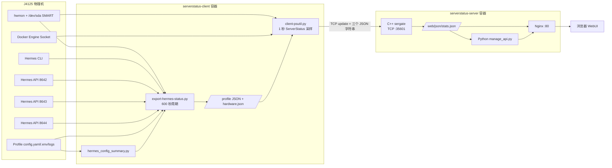
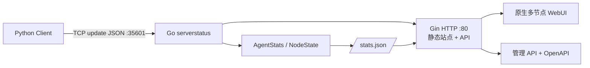
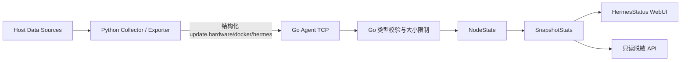

# HermesStatus 架构分析

## 目录

- [基线](#基线)
- [1.0 当前架构](#10-当前架构)
- [Backend](#backend)
- [Frontend](#frontend)
- [Protocol 与 API](#protocol-与-api)
- [Docker](#docker)
- [Client 与 Server](#client-与-server)
- [原生与定制边界](#原生与定制边界)
- [2.0 Go 基线](#20-go-基线)
- [迁移架构建议](#迁移架构建议)
- [关联文档](#关联文档)

## 基线

- `1.0`：旧版 C++ `sergate`、Python 管理 API、Nginx 静态服务和 Python 客户端的深度定制版本。
- `2.0`：与 cppla/ServerStatus Go master 同步的单 Go 进程服务，当前不包含 HermesStatus 定制字段。
- 本文只描述迁移资产，不提出本阶段代码变更。

## 1.0 当前架构

### Backend

服务端由三个进程组成：Nginx 提供静态文件和反向代理，`manage_api.py` 提供管理 API，C++ `sergate` 处理客户端长连接并持续生成 `stats.json`。HermesStatus 在 C++ 客户端状态结构中加入三段 JSON 缓冲区，并把它们原样嵌入快照。

Hermes 领域采集主要在客户端容器完成，而不是服务端完成。这样能直接访问宿主机传感器、Docker Socket、Hermes CLI、Profile 配置与 loopback API。

### Frontend

`web/index.html`、`web/js/app.js` 和 `web/css/app.css` 被改造成单主机仪表盘。前端只轮询 `json/stats.json`，不接触 Hermes API Key。Profile 详情数据已经预先脱敏并嵌入快照。

### Protocol 与 API

- ServerStatus 原生：客户端登录后以单行 `update {json}` 上报，服务端生成 `/json/stats.json`。
- HermesStatus 定制：上报增加 `hardware_json`、`docker_json`、`hermes_json` 三个 JSON 字符串；C++ 包上限由 1400 提升到 65536 字节。
- 管理 API：沿用 `/api/config` 和各集合 CRUD，新增 `/api/hermes/config-summary`。
- 外部依赖 API：每个 Hermes Profile 通过 Bearer Token 调用 loopback HTTP API；Docker 通过 Unix Socket HTTP 调用。

详见 [API_DIFF.md](API_DIFF.md)。

### Docker

1.0 仍保持服务端和客户端两个容器：

- 服务端容器：C++ `sergate` + Python 管理 API + Nginx。
- 客户端容器：Python/psutil + Hermes exporter + SMART/YAML 工具。
- 客户端使用 `network_mode: host`、`pid: host`、`privileged: true`，并挂载 hwmon、`/dev`、Docker Socket、宿主机 OS 信息、Hermes 目录及快照目录。

### Client 与 Server

| 层 | ServerStatus 原生职责 | HermesStatus 定制职责 |
| --- | --- | --- |
| Client | CPU/内存/磁盘/网络/延迟采样，TCP 上报 | 物理机身份、SMART、温度、Docker、Hermes Profile、限额和状态文件合并 |
| Server | 客户端认证、连接状态、月流量、SSL 状态检查、stats 输出 | 接收三组扩展 JSON、嵌入 stats、扩大缓冲区和修复空数组序列化 |
| Web | 多节点、监测、SSL、配置管理 | 单主机概览、硬件行、Hermes 表/弹窗、Docker 表 |
| Management API | 配置 CRUD、重载、重启 | 脱敏 Hermes 配置摘要查询 |

## 原生与定制边界

| 范围 | ServerStatus 原生 | HermesStatus 自定义 |
| --- | --- | --- |
| 资源基础指标 | CPU、内存、磁盘、uptime、网络、I/O | 统一卡片布局与阈值样式 |
| 主机身份 | `os`、Go 2.0 的 `cpu_model` | 宿主机 OS bind mount、`lscpu` 优先读取、显示清洗 |
| 硬件健康 | 无 | HS-005 至 HS-008 |
| Docker | 无 | HS-009 |
| Hermes | 无 | HS-010 至 HS-021、HS-024 |
| TCP 协议 | 登录、`update`、监测配置下发 | HS-022 三组扩展字段 |
| HTTP API | stats、health、配置 CRUD | Hermes 配置摘要 |
| 前端 | 多节点/监测/SSL/配置 | HS-001 至 HS-003、HS-025 |
| 部署 | 双容器、host network/PID | 特权设备和数据挂载、刷新器、可配置路径 |

## 2.0 Go 基线

Go 2.0 的主要变化：

1. C++ `sergate`、Nginx 和 Python 管理 API 合并为一个 Go 进程。
2. `AgentStats` 使用强类型 JSON 反序列化，当前没有 `hardware`、`docker`、`hermes` 字段。
3. TCP scanner 最大请求体为 1 MiB，容量足以承载 1.0 当前负载，但必须新增明确的数据类型、验证和快照映射。
4. `/json/stats.json` 由内存快照直接返回并持久化到 `STATS_PATH`。
5. 管理 API、OpenAPI、配置原子写入、SSL 状态检查和静态站点均由 Go 实现；Release C 删除告警引擎和通知回调。

## 迁移架构建议

建议保留“宿主机侧采集、服务端只接收结构化结果”的总体边界，但在 Go 端避免继续使用 JSON-in-string：

迁移原则：

- 第一阶段继续复用已验证的 Python 采集器，先迁移 Go 数据模型、协议和 UI，降低一次性重写风险。
- Hermes API Key 只存在于客户端采集容器；Go 服务端和浏览器都不应接收密钥。
- 将 `hardware`、`docker`、`hermes` 建成 Go 明确类型，并分别设定数量、字符串长度和总 payload 上限。
- Hermes 的 600 秒刷新与 ServerStatus 的秒级资源采样分离；快照中保留每个域的独立 `updated_at`/stale 状态。
- 待行为等价验证完成后，再评估把部分 Python 采集逻辑重写为 Go；不建议首批一次迁移。

## 关联文档

- 功能编号：[FEATURE_MATRIX.md](FEATURE_MATRIX.md)
- 后端文件级差异：[BACKEND_DIFF.md](BACKEND_DIFF.md)
- 配置与依赖：[CONFIG_DIFF.md](CONFIG_DIFF.md)、[DEPENDENCY.md](DEPENDENCY.md)
- 分阶段方案：[MIGRATION_PLAN.md](MIGRATION_PLAN.md)
