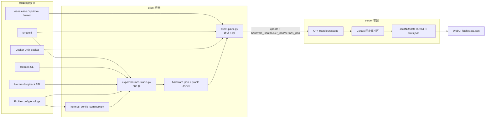
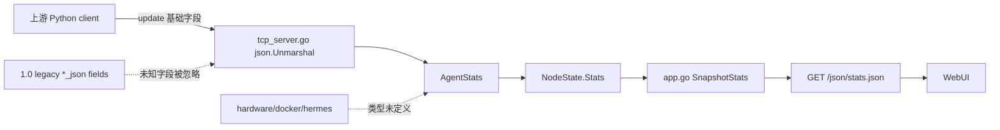
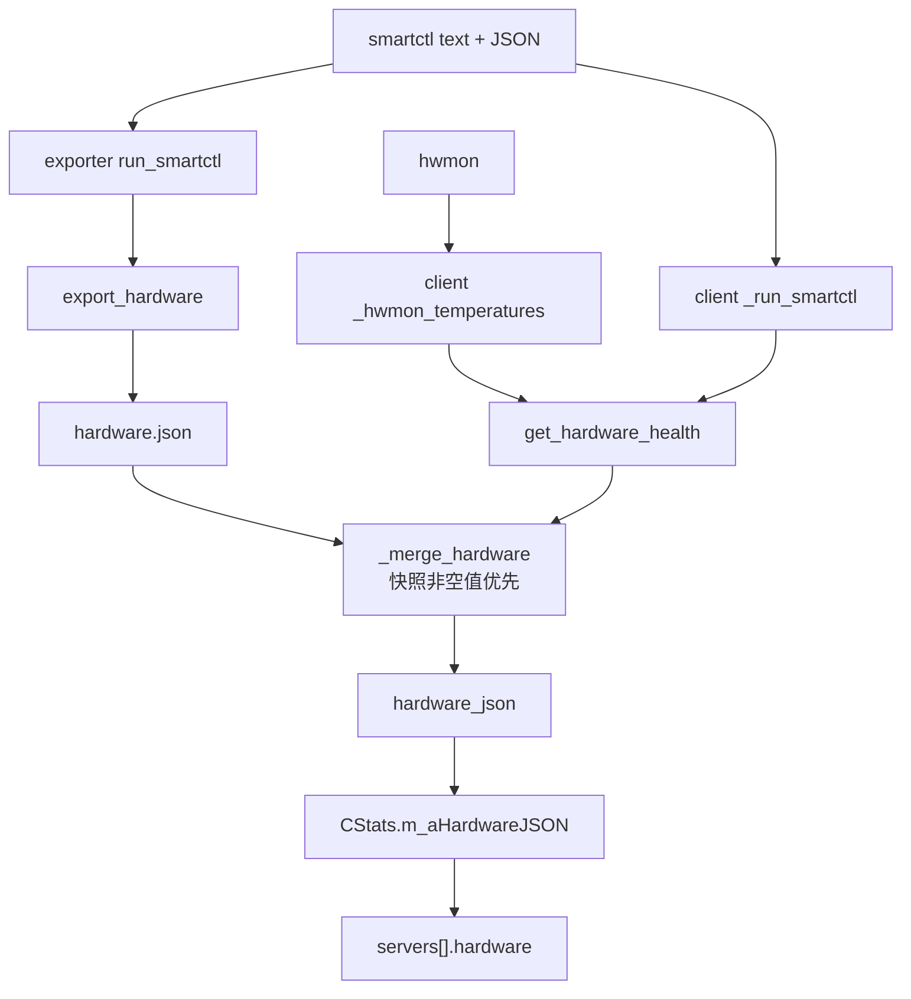
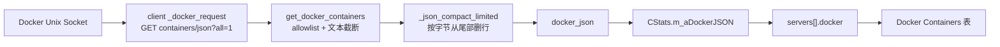
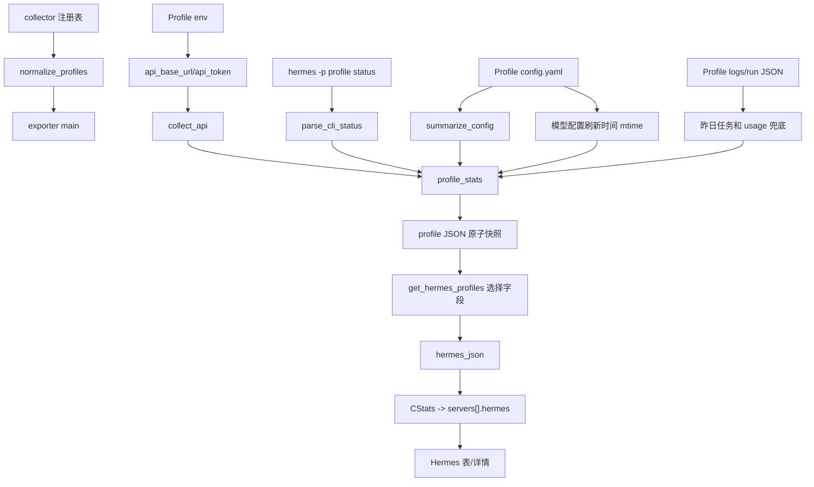

# HermesStatus 数据链追踪

## 目录

- [目的](#目的)
- [基线边界](#基线边界)
- [1.0 总链路](#10-总链路)
- [2.0 当前链路](#20-当前链路)
- [P0 字段 Trace 索引](#p0-字段-trace-索引)
- [原生资源追踪](#原生资源追踪)
- [Hardware 追踪](#hardware-追踪)
- [Docker 追踪](#docker-追踪)
- [Hermes 追踪](#hermes-追踪)
- [安全边界追踪](#安全边界追踪)
- [字段丢失点](#字段丢失点)
- [已确认 Dashboard 消费点](#已确认-dashboard-消费点)
- [验证证据](#验证证据)
- [关联文档](#关联文档)

## 目的

本文回答一个具体问题：一个值从物理机或 Hermes API 出发，经过哪个函数、哪个中间文件、哪个 wire 字段、哪个服务端状态，最终到达哪个浏览器字段；若没有到达，在哪一层丢失。

## 基线边界

| 层 | 1.0 | 2.0 当前 | 已确认本地 Dashboard |
| --- | --- | --- | --- |
| Collector | 定制 `client-psutil.py` + exporter + config summary | 上游 `client-psutil.py`/`client-linux.py` | 不含 collector 变更 |
| Wire | 原生 update + 三个 JSON string | 强类型 `AgentStats` 基础字段 | 期望 stats 已有三个对象 |
| Server | C++ char buffer + 手工 stats JSON | Go `AgentStats` -> `NodeState` -> `SnapshotStats` | 未修改 Go server |
| Browser | 1.0 单主机 WebUI | 远端 2.0 原生 WebUI | `2fce96b` 加未提交 Web 样式/交互 |

## 1.0 总链路

1.0 不是单一 exporter 链：SMART 同时由 exporter 和 psutil client 采集。exporter 快照中的非空字段在 client merge 时优先，client 的直接采集作为 fallback。

## 2.0 当前链路

Go scanner 的 1 MiB 上限足够接收 1.0 当前 64 KiB 包，但容量并不等于功能兼容：`encoding/json` 对 `AgentStats` 未声明字段默认忽略，因此旧扩展在 `server/tcp_server.go` 的反序列化步骤丢失。

## P0 字段 Trace 索引

下表逐字段固定核心 P0 的完整路径；后续章节展开每个数据域的解析、fallback、限额和安全边界。

| HS | 页面字段 | 1.0 source -> collector/快照 | update payload | 1.0 server -> stats -> Web | 2.0 当前断点 | 目标链路 |
| --- | --- | --- | --- | --- | --- | --- |
| HS-004 | 宿主机 OS | host `os-release` -> `get_host_os_name()` | `os` | `CStats` -> `servers[].os` -> uptime 卡 | 2.0 client 读取容器 `/etc/os-release` | host mount -> Python `os` -> `AgentStats.OS` -> Snapshot -> Web |
| HS-004 | CPU 型号 | `lscpu --json` / `/proc/cpuinfo` -> `get_cpu_model()` | `cpu_model` 和 legacy `hardware_json.cpu_model` | C++ 节点 -> `servers[].hardware.cpu_model` -> CPU 卡 | 2.0 psutil fallback 可能只得到架构/厂商；extension 又被丢弃 | host `lscpu` -> Python `cpu_model` -> `AgentStats.CPUModel` -> Snapshot -> Web |
| HS-005 | CPU 温度 | hwmon -> `_hwmon_temperatures()` -> `get_hardware_health()` | `hardware_json.cpu_temperature` | 4 KiB hardware buffer -> `servers[].hardware.cpu_temperature` -> 温度卡 | 2.0 collector 和 Go model 均缺失 | Hardware collector -> structured `hardware` -> `HardwareStats` -> Snapshot -> Web |
| HS-006 | SMART 状态/设备/来源 | `smartctl -x` 文本优先、JSON fallback -> exporter/client SMART parser -> `hardware.json` merge | `hardware_json.disk_smart_*` | hardware buffer -> `servers[].hardware` -> SMART 卡 | collector 缺失；legacy wire 被 `AgentStats` 丢弃 | 单一 600 秒 SMART collector -> structured hardware -> Go validation -> Web |
| HS-007 | 当前/最高/最低盘温 | Device Statistics `0x05/0x008,0x020,0x028` -> exporter/client parser -> merge | `hardware_json.disk_temperature` | hardware buffer -> `servers[].hardware.disk_temperature` -> 三温卡 | collector/model/Snapshot 全部缺失 | SMART collector -> `DiskTemperatureStats` -> Snapshot -> Web |
| HS-008 | 通电小时、累计写入/读取 | Device Statistics `0x01/0x010,0x018,0x028` -> exporter/client parser -> merge | `hardware_json.disk_power_on_hours/disk_*_bytes` | hardware buffer -> `servers[].hardware` -> 小时/I/O 卡 | collector/model/Snapshot 全部缺失 | SMART collector -> structured counters -> Snapshot -> Web |
| HS-009 | 运行中/总容器及容器行 | Docker Unix Socket `GET /containers/json?all=1` -> `get_docker_containers()` -> byte limit | `docker_json` | 32 KiB Docker buffer -> `servers[].docker` -> 容器卡/表 | 2.0 无 Docker collector；legacy wire 被丢弃 | Docker Socket -> allowlist/sanitize -> `DockerStats` -> Snapshot -> Web |
| HS-010 | Profile 注册与列表 | collector registry -> exporter 原子 Profile 快照 -> `get_hermes_profiles()` | `hermes_json.profiles[]` | 32 KiB Hermes buffer -> `servers[].hermes.profiles[]` -> Profile 表 | 2.0 无 registry/exporter/client reader/Go model | registry -> Profile snapshots -> structured `HermesStats` -> Snapshot -> Web |
| HS-011 | updated_at/stale/error | hardware 仅 exporter 有时间；Docker/Hermes root/Profile 无稳定领域时间 | 三域 JSON，时间/错误不完整 | C++ 原样透传；Web 无法可靠判陈旧 | 合同存在，collector/Go stale 映射未实现 | collector domain time -> Go received/stale/error normalization -> stats -> Web |
| HS-021 | Secret 边界 | Profile env/registry token -> exporter request header | secret 不得进入 payload | 正常路径不进 C++/stats/Web | 2.0 collector 未实现；服务端不得接收 secret | client-only secret -> API call -> allowlist result；server/browser 永不接收 |
| HS-022 | 扩展 wire 与上限 | 三个域对象 -> JSON-in-string + client/server 限额 | `hardware_json/docker_json/hermes_json` | C++ buffer -> stats raw embed | `json.Unmarshal` 忽略未知 legacy/structured 字段 | structured update + legacy adapter -> validation -> NodeState -> Snapshot |
| HS-023 | 宿主机访问 | host network/PID、OS/hwmon/device/socket/Profile/status mounts | 不直接形成字段 | 使 collector source 可见 | 2.0 Compose 未提供这些访问边界 | 最小化 mounts/capabilities -> B3/B4 collectors -> B6 实机验证 |

## 原生资源追踪

| 数据 | Source | Collector | Wire | Server state | Snapshot | Browser target | 结论 |
| --- | --- | --- | --- | --- | --- | --- | --- |
| CPU | psutil 或 `/proc/stat` | `get_cpu()` | `cpu` | `AgentStats.CPU` | `servers[].cpu`，转整数 | CPU 百分比条 | 贯通 |
| 内存 | psutil `/proc/meminfo` 视图 | `get_memory()` | `memory_total/used` KiB | `AgentStats.Memory*` | 同名字段 | 内存值与百分比 | 贯通，宿主机口径待核 |
| 硬盘容量 | psutil partitions/usage | `get_hdd()` | `hdd_total/used` MiB | `AgentStats.HDD*` | 同名字段 | 硬盘值与百分比 | 贯通，mount 口径待核 |
| uptime | boot time | `get_uptime()` | 秒 | `AgentStats.Uptime` | Go 格式化中文字符串 | 已运行时间 | 贯通 |
| CPU 核数 | psutil 或 `/proc/stat` | `get_cpu_cores()` | `cpu_cores` | `AgentStats.CPUCores` | `servers[].cpu_cores` | 当前 Dashboard 不显示 | 贯通 |
| OS | 容器内 `/etc/os-release` | update loop | `os` | `AgentStats.OS` | `servers[].os` | uptime 卡第二行 | 链路贯通，2.0 来源错误 |
| CPU 型号 | psutil client 的 `platform.*` | `get_cpu_model()` | `cpu_model` | `AgentStats.CPUModel` | `servers[].cpu_model` | CPU 卡 | 链路贯通，2.0 采集质量不足 |

Go 重启时 `restorePersistentState()` 只从旧 stats 恢复月流量基线、OS 和 CPU model；CPU/内存/硬盘/uptime 要等待 client 新 update。

## Hardware 追踪

### 1.0 路径

| 阶段 | 文件/函数 | 行为与边界 |
| --- | --- | --- |
| 设备选择 | `scripts/export-hermes-status.py:smart_candidates`; client `_smart_candidates` | `SMART_DEVICE`，否则 scan/glob/分区候选 |
| 命令执行 | exporter `run_smartctl`; client `_run_smartctl` | 先 `-x` 文本，再 `-x -j` JSON，允许无密码 sudo/直接调用 |
| 健康解析 | `smart_text_passed` / `_smart_text_passed` | overall-health 文本优先，JSON 兜底 |
| Device Statistics | `smart_stat_value` / `_smart_stat_value` | 精确匹配 page、offset、description |
| 快照 | exporter `export_hardware` + `atomic_write` | 写临时文件后 replace；带 `updated_at` |
| 合并 | client `_merge_hardware` | exporter 非空字段覆盖 direct fallback；unknown 不覆盖 passed/failed |
| wire | client update loop | `hardware_json` 没有 client 端显式 4 KiB 裁剪 |
| server | C++ `HandleMessage` | 小于 4096 字符才保存，否则变 `{}` |
| stats | C++ `JSONUpdateThread` | 原样嵌入，没有结构或 secret 验证 |

### 2.0 当前断点

1. 2.0 client 没有 hwmon、SMART 或 `hardware` 采集代码。
2. `AgentStats` 没有 `Hardware` 字段，也没有 legacy `hardware_json` wire 适配。
3. `NodeState` 和 `SnapshotStats` 没有 hardware 映射。
4. 已确认 Dashboard 会读取 `host.hardware`，但真实 Go stats 不会提供该对象。

## Docker 追踪

| 阶段 | 已确认行为 | 风险/缺口 |
| --- | --- | --- |
| Transport | 手写 Unix Socket HTTP/1.1，支持 chunked body | 不检查 HTTP status line；异常为自由文本 |
| Mapping | 只选择 Id/Image/Command/Created/Status/State/Ports/Names | Command 只截断，不脱敏 |
| Count | running 统计完整 rows；total 为 rows 长度 | 正常 |
| Row limit | 配置 limit 后先截数组 | 默认 0 为全部 |
| Byte limit | 默认 12000 bytes，逐行从尾部裁剪 | `total` 保留但 UI 需识别 truncated |
| Server | 32 KiB char buffer，原样嵌入 | 不做 Schema 验证 |
| 2.0 | client、AgentStats、Snapshot 全部没有 Docker 扩展 | 从源头缺失；legacy wire 也被忽略 |

Profile 详情中的 `docker_volumes` 不来自 Docker inspect；它来自 Hermes Profile `config.yaml` 的 `terminal.docker_volumes`。

## Hermes 追踪

### 配置与采集链

### 来源优先级

| 最终字段 | 1.0 来源顺序 | 在哪一层裁剪/变形 |
| --- | --- | --- |
| Profile identity | 注册表 name | client 保留 |
| service/API | `/health` -> CLI/service state | client 保留字符串 |
| gateway/manager | CLI -> service state | client 保留 |
| model/provider | CLI ->本地模型/health | client 保留 |
| usage mode/auth refresh | CLI | client 保留 |
| jobs count | API 有限 jobs 列表 -> CLI | exporter 受 `MAX_TABLE_ROWS` 影响 |
| sessions | API 分页 -> CLI | client 只保留 count/has_more，不保留行 |
| usage | jobs + sessions -> health -> 本地昨日日志 -> 0 estimated | client 只保留 token 四字段，窗口信息不存在 |
| config summary | YAML 安全投影 | client 保留整个 summary，包括路径/挂载 |
| jobs/sessions/capabilities details | API | client 明确不复制，最终 stats 丢失 |
| runs | 固定 `[]` | 没有采集 |

### 2.0 当前断点

1. 2.0 没有 exporter、config summary、注册表或状态目录。
2. 2.0 client 没有 Profile JSON 读取和 `hermes` 上报。
3. Go server 没有 Hermes 结构体、legacy parser、NodeState/Snapshot 映射。
4. 已确认 Dashboard 已有 Hermes 表格和 Profile 弹窗，但只能用 fixture 验证结构，真实环境会得到空数组。

## 安全边界追踪

| 敏感内容 | 1.0 进入点 | 1.0 是否进入 wire/stats | 目标规则 |
| --- | --- | --- | --- |
| Hermes API key | 环境、Profile env、注册表 | 正常路径不进入；只在请求 header | 永不进入 server 或 browser |
| Profile `.env` 原文 | exporter `load_profile_env` | 不直接进入 | 仅采集进程内存 |
| config secret | YAML parser | `sensitive_flags` 只输出 configured/source | 继续 allowlist，不输出值 |
| config path/checked paths | config summary | 会进入 stats/browser | Release A 不输出真实路径 |
| Docker command | Docker API 原始响应可能包含 | 否 | Release C 采集器不读取，Go 合同不接收，stats/browser 不输出 |
| Docker error | Python exception text | 会进入 stats/browser | 结构化 error，不带 raw text |
| Hermes note/API error | exception/API status/Profile dir | 会进入 stats/browser | 结构化 code/status；不带路径/响应体 |
| legacy raw JSON | client wire | C++ 原样保存并嵌入 | Go 解析后立即丢弃 raw string |

## 字段丢失点

| 编号 | 位置 | 输入 | 丢失机制 | 影响 |
| --- | --- | --- | --- | --- |
| L-01 | 2.0 `clients/` | 物理机 hwmon/SMART/Docker/Hermes | 采集代码不存在 | 扩展从源头为空 |
| L-02 | `server/tcp_server.go` JSON unmarshal | 1.0 `hardware_json/docker_json/hermes_json` | `AgentStats` 未声明，未知字段被忽略 | 旧 client 与 Go server 功能不兼容 |
| L-03 | `server/model.go` | 结构化 `hardware/docker/hermes` | 类型未定义，未知字段被忽略 | 新结构也无法进入 NodeState |
| L-04 | `server/app.go:SnapshotStats` | 即使未来 NodeState 暂存扩展 | 当前只手工映射原生字段 | stats 不输出扩展 |
| L-05 | 1.0 `client-psutil.py:get_hermes_profiles` | exporter jobs/sessions/capabilities | allowlist 未复制明细 | 不能计入现有 Web/API 合同 |
| L-06 | 1.0 exporter | Profile 采集完成时间 | payload 没有 `updated_at` | Web 无法判断 Profile freshness |
| L-07 | 当前 Dashboard | backend domain `updated_at` | 顶栏显示浏览器 fetch 成功时间 | 可能把陈旧数据显示成刚刷新 |
| L-08 | 当前 fixture adapter | extension root fixture | JS 本地包装成一个 fake host | fixture 通过不证明 Go stats 管线已贯通 |

## 已确认 Dashboard 消费点

当前本地 Dashboard 已通过自动测试，数据映射如下；这些 Web 文件未包含在本次文档分支。

| UI | 读取字段 | 当前真实后端状态 |
| --- | --- | --- |
| CPU 卡 | `hardware.cpu_model ?? host.cpu_model`, `host.cpu` | 百分比有值；model 可能来源错误 |
| 内存卡 | `memory_used/total` | 原生可用，宿主机口径待核 |
| 硬盘卡 | `hdd_used/total` | 原生可用，mount 口径待核 |
| 容器卡/表 | `docker.running/total/containers[]` | Go stats 缺失 |
| 运行时间/系统 | `uptime`, `os` | uptime 有值；OS 当前来自容器 |
| 硬件五卡 | `hardware.*` | Go stats 缺失 |
| Hermes 表/弹窗 | `hermes.profiles[]` | Go stats 缺失 |
| 上次刷新 | 浏览器成功 fetch 时间 | 不是 hardware/docker/hermes 的采集时间 |

## 验证证据

审计期间已执行：

- 1.0 四组 exporter/config/payload 测试：通过。
- 迁移合同脚本：全部 Markdown 内部链接、2 个 Schema、8 个 fixture 均通过。
- 当前本地 Dashboard JavaScript 测试：通过。
- Go tests：本机没有系统 Go toolchain，本轮未执行；这不是代码失败证据。
- 目标物理机命令：本阶段未执行，所有设备相关项保持“待实机”。

## 关联文档

- 逐字段来源：[DATA_SOURCE_MAP.md](DATA_SOURCE_MAP.md)
- 缺口分级：[DATA_GAP_REPORT.md](DATA_GAP_REPORT.md)
- 决策记录：[DATA_SOURCE_DECISIONS.md](DATA_SOURCE_DECISIONS.md)
- PR 拆分：[MILESTONE_B_PR_PLAN.md](MILESTONE_B_PR_PLAN.md)
